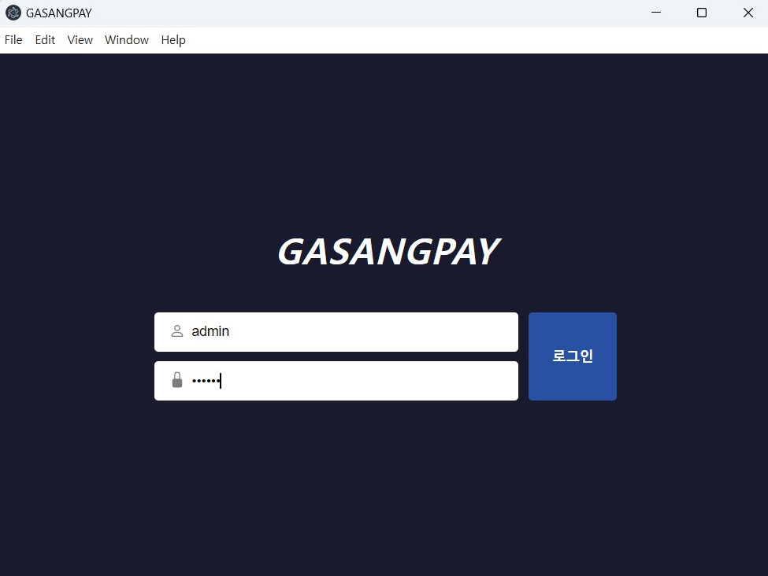

# GasangPay
## 가상 이용 유의사항
■ 입금은 일반적으로 입금된 후 약 1분후에 완료됩니다. 이는 PG사의 안전 조치를 위함입니다.

■ 회원등록을 하는 바법은 다음과 같습니다.
- 가맹점 사이트에서 개별적으로 생성
- 엑셀 업로드
- 유저에게 링크를 제공하고 유저가 직접 회원가입

■1원 인증을 수행할 때, 재전송이 불가능합니다. 1일에 한 번만 전송할 수 있습니다. 따라서 회원를 삭제하고 다시 생성하면 1원 인증 진행에 문제가 발생할 수 있습니다.

## 가상계좌 발급 유의사항

■ 1인 1가상계좌로 중복 발급되지 않습니다. (회원 삭제 후 동일정보로 재발급 불가)

■ 이미 발급된 가상계좌가 있다는 메시지가 나오는 경우, 해당 회원이 신협은행 가상계좌를 발급 받은 업체를 통해
신협 가상계좌가 삭제 또는 폐기 되어야 발급이 가능 합니다. 신협가상을 발급한적 없는 출금계좌로는 등록이 가능 합니다.

■ 회원정보 등록 가상계좌 발급시 올바른 예금주명을 입력하여 주시기 바라며, 계좌번호는 (-)없이 숫자만 입력하시기 바랍니다.

■ 휴대폰 연락처 정보는 반드시 휴대폰 번호 유형으로 등록되어야 합니다. 예) 01043216789 (O)

■ 가상계좌 발급을 위해 은행명, 계좌번호, 예금주가 정확해야 하며, 예금주가 정확하게 일치해야 합니다.
(유저회원이 외국인인 경우에 문제가 발생하는 상황이 생긴다면 알려주세요.)

■ 가맹점 정보를 정확히 전달해 주시기 바랍니다.

## 로그인
발급 받은 admin 계정을 이용해 먼저 로그인합니다.

 

##  사용법

